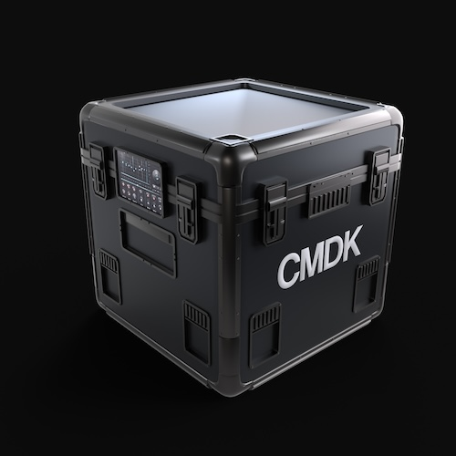

# CMDK Genesis Kits



The CMDK Launch Kit tokens are extended from the [ERC404](https://github.com/Pandora-Labs-Org/erc404) implementation.

Code style follows [Natspec](https://docs.soliditylang.org/en/latest/style-guide.html)

## Usage

### Build

```shell
$ npm i
```

### Test

[](https://github.com/CMDKONE/cmdk-launch-kit/actions/workflows/test.yml)

```shell
$ npm test
```

#### With verbose logging

```shell
$ npm run test:logs
```

### Security Scans

[](https://github.com/CMDKONE/cmdk-launch-kit-kit/actions/workflows/slither.yml)

Security scanning is done via the Slither gitaction. Vulnerabilities can be viewed [here](https://github.com/CMDKONE/cmdk-launch-kit-kit/security/code-scanning).

### Deployment

Copy over env var file

```shell
$ cp .env.example .env
```

Load the variables in the .env file

```shell
$ source .env
```

#### Deploy CMDK Token

```shell
$ npm run deploy:cmdk:[mainnet or testnet]
```

#### Deploy Support Rewards for MODA

```shell
$ npm run deploy:claiming:[mainnet or testnet]
```
